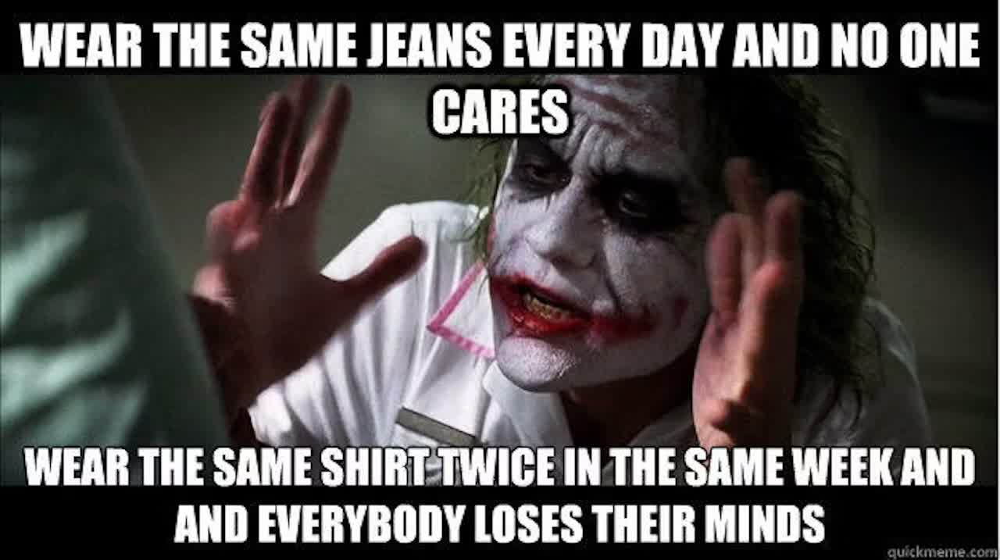

# math quiz program

# table of contents
1. [goal](#goal)
2. [useful links](#useful-links)
3. [credits](#credits)

# goal
this program's job is to mimic quizlet or webwork but with kivy and python instead.  

# useful links
## github repo link 
put this later

# credits
duncan holmes