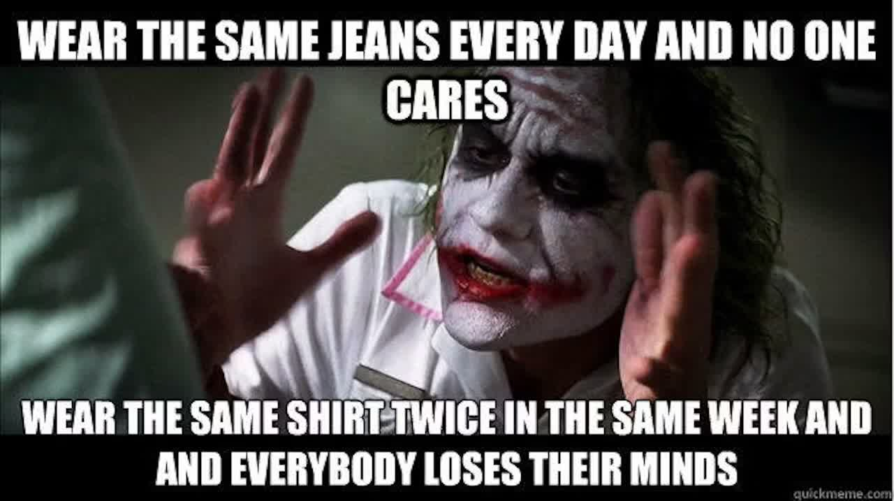

# math quiz program


# table of contents
1. [goal](#goal)
2. [useful links](#useful-links)
3. [credits](#credits)

# goal
this program's job is to mimic quizlet or webwork but with kivy and python instead.  

# useful links

## github repo link 
https://github.com/Zoorackzoos/math_quiz_program

## design doc
https://docs.google.com/document/d/1zBRpkKCJK8A2hu6dSd9rOtjoeuYnwPgb4tJTkRei9Iw/edit?usp=sharing

# how run in PyCharm
go to:
```terminaloutput
src/GUI/GUI_master.py
```
and run it there. 

# credits
duncan holmes